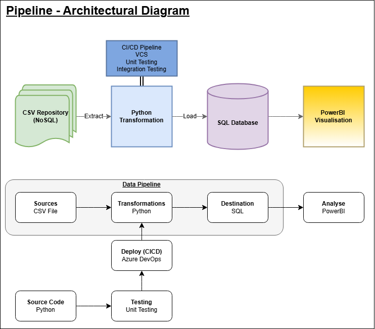
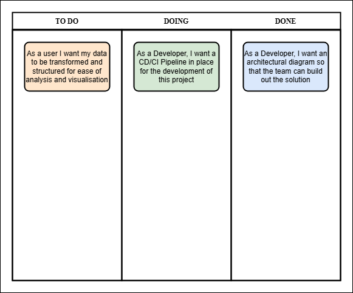
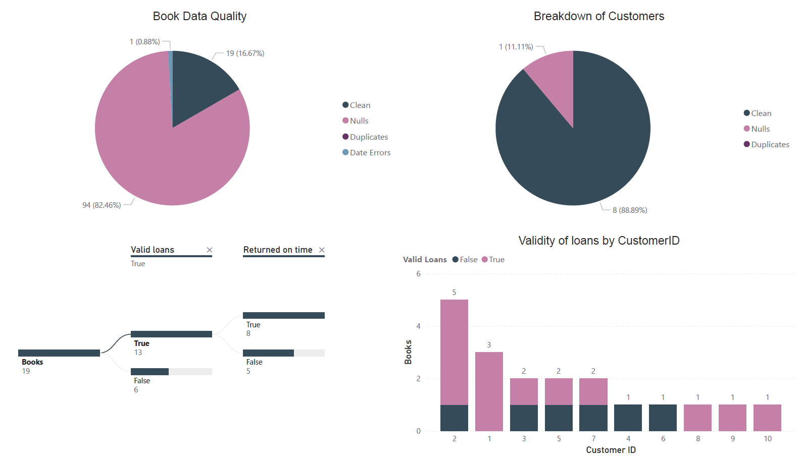

# DE5-M5 - Library Solution 

##### Narrative

Library is seeking a solution to improve their data processing and analysis through the use of a Python based data pipeline.

Currently their data processing tasks are manual and time consuming.

Through the use of automated data cleansing we can cut down on the manual work that is currently required.
Quality metrics will provide the Library with actionable points for improving their data gathering processes and overall data quality.

## Architectural Diagram

The proposed solution for the MVP:

## Kanban board

## Data pipeline implementation

Through the use of Python and Pandas, we are able to;

- Extract the original low quality data.
- Clean and transform the data.
- Enrich and gather quality metrics.
- Load the data into a new .csv file for use in PowerBI.

## Analysis key points

- Dropped rows due to nulls/blank and error rows.
- A number of invalid loans due to differences in dates.
- A number of late returns on the loans.

## PowerBI dashboard/visualisation for the cleaned data

## Python app packaged as a Docker image for portable usage

